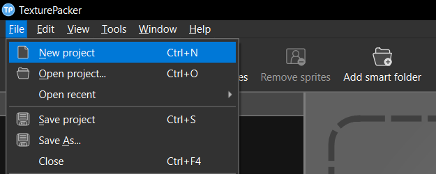
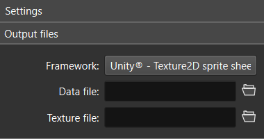
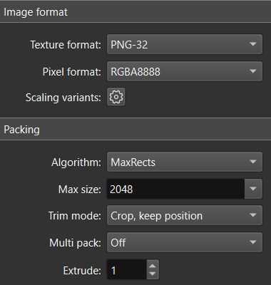
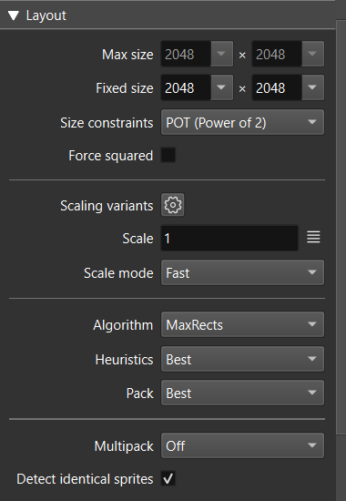
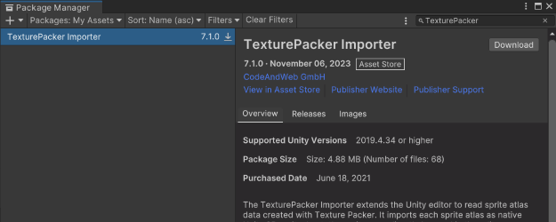
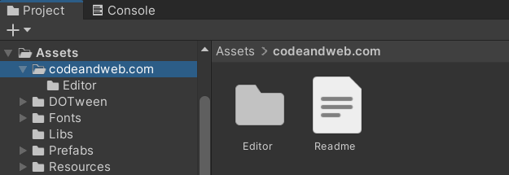
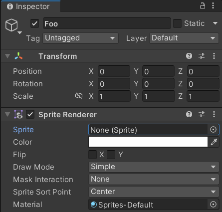
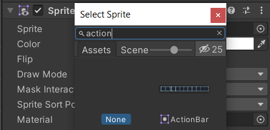

If you’re developing a 2D Unity game, as I am right now, it’s likely that you’ll be working with a lot of sprites. My project currently has about 8k individual sprite assets, so a fairly significant amount that requires some thought given to managing it all. If your project has a lot of sprites then using a tool like [TexturePacker](https://www.codeandweb.com/texturepacker) will not only improve your game’s performance, but it can also help keep your project organized.

This post details how to configure a TexturePacker sprite sheet for Unity, how to import the published sprite sheets into Unity, and how to reference individual sprites programmatically with C#.

The benefits of using sprite sheets (also called _sprite atlases_, or _texture atlases_) are [described here](https://docs.unity3d.com/2022.3/Documentation/Manual/sprite-atlas.html) in the Unity manual:

> Unity typically issues a [draw call](https://docs.unity3d.com/2022.3/Documentation/Manual/DrawCallBatching.html) for each texture in the scene; however, in a project with many textures, multiple draw calls become resource-intensive and can negatively impact the performance of your project.
>
> A **Sprite Atlas** is an asset that consolidates several textures into a single combined texture. Unity can call this single texture to issue a single draw call instead of multiple draw calls to access the packed textures all at once at a smaller performance overhead.

That alone sounds like a great reason to use sprite sheets in Unity, but there are other potential benefits too.

For example, in my project I wanted to have separate repos for my Unity game and sprite assets, where the Unity repo contains only the published sprite sheets, and the assets repo contains all ~8k individual .png sprites. This separation of concerns was attractive to me because I wanted to version my sprite assets, but I didn’t want asset commits mingling with code commits, and I also didn’t want to generate ~8k .meta files in my Unity project. My TexturePacker project files live in the assets repo, separate from Unity, and I have them configured to publish sprite sheets directly into the Assets folder of my Unity project. This setup keeps things manageable for me on the Unity side, and organized on the assets side.

Regardless of how you decide to organize your project, there are some clear benefits to using sprite sheets. So without further ado, let’s get started with using sprite sheets in Unity!

## Configure a TexturePacker Sprite Sheet for Unity

### Create a New TexturePacker Project

When you open TexturePacker it will create a new empty project, or you can create a new project by selecting **File > New project**.



:::note
All screenshots are from TexturePacker version **7.4.0**
:::

### Add Sprites to the Project

The best way to do this is by clicking the **Add smart folder** button in the toolbar at the top, and browsing for the folder containing your sprites. Selecting a folder here not only adds all the sprites in that folder, but it will also add all of its subfolders and all the sprites in those subfolders. If your sprites are organized into sensible folder trees, you can just select the appropriate root folder(s) here. The great part about smart folders is that whenever the contents of the folders change, TexturePacker will automatically update the sprite sheet (as opposed to simply adding individual sprites, where you would need to manage them manually).

:::note[Before you proceed]
Since this will come up later, it’s important to mention here that **all sprites in your project should have unique file names**. If this is not the case in your project, it could result in unexpected behavior in the steps below.
:::

### Configure the Project Settings

First, select **Unity - Texture2D sprite sheet** for _Framework_, in the _Settings_ panel on the right hand side. This will pre-populate some of the other settings.



Choose a location for the _Data file_ and _Texture file_. These are the files that TexturePacker will create when you publish the sprite sheet. The location needs to be inside the Assets folder of your Unity project (I chose `Assets/Resources/Textures` for my project). The folder structure is up to you, but you should put them somewhere inside the Resources folder. I recommend giving both files the same name and putting them in the same folder.

When you publish the sprite sheet, TexturePacker will create two files: a **.tpsheet** data file and a texture **.png**. The data file describes how the sprites are packed in the texture, which Unity uses to access the individual sprites.

The _Image format_ and _Packing_ settings I used are shown here:



-   Texture format: **PNG-32**
-   Pixel format: **RGBA8888**
-   Algorithm: **MaxRects**

All the sprites in my project are basically rectangular so I chose **MaxRects** for _Algorithm_, since **Polygon** has more overhead.

-   Max size: **2048**
-   Trim mode: **Crop, keep position**

_Trim mode_ depends heavily on how you deal with positioning the sprites in your game, relative to how the sprite assets are drawn. For instance **Crop, keep position** will trim the transparency without affecting how you would position the sprites in Unity (you can position them as if they have their original dimensions). Depending on your needs, another option might be more appropriate here.

_Multi pack_ is for situations where you have more sprites than can fit on a single sprite sheet; in that case it will create additional .tpsheet and .png files to accommodate the extra sprites. Since I don’t make use of this feature I have it set to **Off**.

:::tip
You can hover your mouse over the setting name to see more detailed information about that setting.
:::

At the bottom of the _Settings_ panel is an **Advanced settings** button, clicking this will reveal more settings:



If you’re working with pixel art, it’s a good idea to set _Scale mode_ to **Fast**. This way you can scale up your sprites without blurring.

Now that the settings are configured, save the project by clicking the **Save project** button. This saves the project as a **TexturePacker Sprite Sheet** (**.tps**) file. In the next step, we’ll need to edit this .tps file.

### Edit the .tps Project File

For this step, first we’ll look inside the **.tpsheet** data file to see the names TexturePacker gives to the sprites in our sprite sheet.

Publish the sprite sheet by clicking **Publish sprite sheet**, then go to the location of your .tpsheet file and open it using a plain text editor.

In this file you should see a list of sprite names and their associated data. The filenames of the original sprite .pngs are used as the sprite names in the data file— However, if you added a smart folder in the steps above, and you have nested subfolders containing sprites, notice how the sprite names are prefixed with folder path segments. Something like:

```
Folder-Subfolder-SpriteName
```

We need to tell TexturePacker not to include those path segments in our sprite names, in order for the code we’re going to write in Unity to work.

To do this, open the **.tps** project file in a plain text editor.

Locate the following section:

```xml
<key>replaceList</key>
<array/>
```

and replace it with these lines to remove all path segments from the sprite names:

```xml
<key>replaceList</key>
<array>
  <string>.*/=</string>
</array>
```

Now if you publish the sprite sheet again and look at the .tpsheet file in a text editor, you should see that the sprite names do not include path segments.

:::note
This information can be found on the [TexturePacker hidden features](https://www.codeandweb.com/texturepacker/documentation/hidden-features) page.
:::

## Working with TexturePacker Sprite Sheets in Unity

### Add the TexturePacker Importer extension

In order to work seamlessly with TexturePacker sprite sheets in Unity, you’ll need to add the [TexturePacker Importer extension](https://assetstore.unity.com/packages/tools/sprite-management/texturepacker-importer-16641) to your project. Here’s how:

-   Open your Unity project
-   Go to the [TexturePacker Importer page on the Unity Asset Store](https://assetstore.unity.com/packages/tools/sprite-management/texturepacker-importer-16641) and select **Add to My Assets**
-   Click the **Open in Unity** button, which should open Unity and bring up the Package Manager showing the asset
    -   Alternatively, select **Window > Package Manager** from the Unity menu, and look under **My Assets** in the _Packages_ dropdown

At this point you should see something like this:



-   Click **Download**
-   Click **Import**

Once imported, it should look something like this in your project:



:::note
All screenshots are from Unity version **2022.3.21**
:::

Now when you publish your sprite sheets from TexturePacker, Unity will pick up on the changes and automatically re-import the sprite sheets and make them ready to use.

### Reference Individual Sprites in the Inspector Window

The final step is actually using the sprites in your game. It’s important to note here that you can reference the individual sprites in the Unity Editor without using C#, via the Inspector window.

For example, let’s create an empty GameObject in our scene named "Foo" and add a SpriteRenderer to it:



Now if you click the little target icon next to the _Sprite_ field in the SpriteRenderer, you can type in the name of the sprite, select it, and you will see the individual sprite displayed in the GameObject in your scene.



So, you can easily reference the sprites in your sprite sheet using the Inspector window. But what if your game relies on code to dynamically create GameObjects at runtime, how can you get references to the sprites then? For that, we’ll need to write some C#.

### Reference Individual Sprites via C# Scripts

Now we’ll take a look at how to create a map of the sprites in your sprite sheet. Using this map, you’ll be able to reference individual [Sprite](https://docs.unity3d.com/2022.3/Documentation/ScriptReference/Sprite.html) objects by name (the same name as the original .png file) using C#.

:::note
Keep in mind that in order for this to work, all sprites in your project need to have unique file names. This is because:

1. We are stripping away the folder prefixes that TexturePacker would normally include in the sprite names to avoid conflicts
2. We are using these sprite names as unique dictionary keys in our C# code
   :::

For this example, we’ll create an AssetManager class which extends MonoBehaviour. This can be added to the scene where you want to use the sprites.

```c#
using System.Collections.Generic;
using UnityEngine;

public class AssetManager : MonoBehaviour {

  private Dictionary<string, Sprite> _spriteMap;

  private void Awake() {

    _spriteMap = new();

    // Loads "SpriteSheet.tpsheet" located in Assets/Resources/Textures/
    Sprite[] sprites = Resources.LoadAll<Sprite>("Textures/SpriteSheet");
    foreach (Sprite sprite in sprites) {
      _spriteMap.Add(sprite.name, sprite);
    }

  }

  public Sprite GetSprite(string key) {
    if (_spriteMap.ContainsKey(key)) {
      return _spriteMap[key];
    }
    return null;
  }

}
```

What we’re doing is using [Resources.LoadAll()](https://docs.unity3d.com/2022.3/Documentation/ScriptReference/Resources.LoadAll.html) to return an array of [Sprite](https://docs.unity3d.com/2022.3/Documentation/ScriptReference/Sprite.html) objects from our sprite sheet, and then adding these objects to the `_spriteMap` dictionary using their names as the key. The `GetSprite` method takes `key` as a parameter, and uses it to look up and return the sprite in the dictionary (if it exists).

Now we can get references to our sprites using their names. Awesome! But let’s go a step further and write a method that returns a [GameObject](https://docs.unity3d.com/2022.3/Documentation/ScriptReference/GameObject.html) that we can use in our scene.

Add these methods to the AssetManager class:

```c#
  public GameObject CreateSprite(string key) {
    return CreateSprite(GetSprite(key));
  }

  public GameObject CreateSprite(Sprite sprite) {
    GameObject gameObject = new();
    SpriteRenderer renderer = gameObject.AddComponent<SpriteRenderer>();
    if (sprite != null) {
      renderer.sprite = sprite;
    }
    return gameObject;
  }
```

Now you can easily create a new sprite with C#, using only the name of the sprite asset, like so:

```c#
GameObject foo = assetManager.CreateSprite("Foo");
// The "Foo" argument here refers to the asset "Foo.png"
```

[Here’s the full AssetManager class in a GitHub gist.](https://gist.github.com/bencolwell/5fe48766833ceb485aa68a48fe9951b2)

## Conclusion

At this point, you should be able to:

-   Publish your sprite sheet and have Unity automatically re-import it
-   Reference individual sprites either in the Inspector window or via C#
-   Create sprite GameObjects dynamically using C# at runtime

The general workflow for updating sprite assets now becomes:

**Add, remove, or edit sprites &#8594; Open .tps file in TexturePacker and publish &#8594; Unity automatically imports the updated sprite sheet**

That’s it! Now you can enjoy more efficient sprite rendering while your game is running, while also having the benefits of a more organized project. This is a setup that’s worked great for me while developing my pixel art game, and I hope it works great for you in your project as well.
